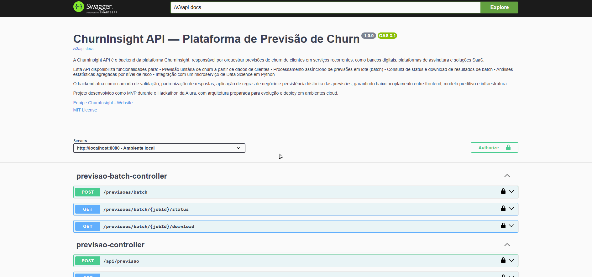
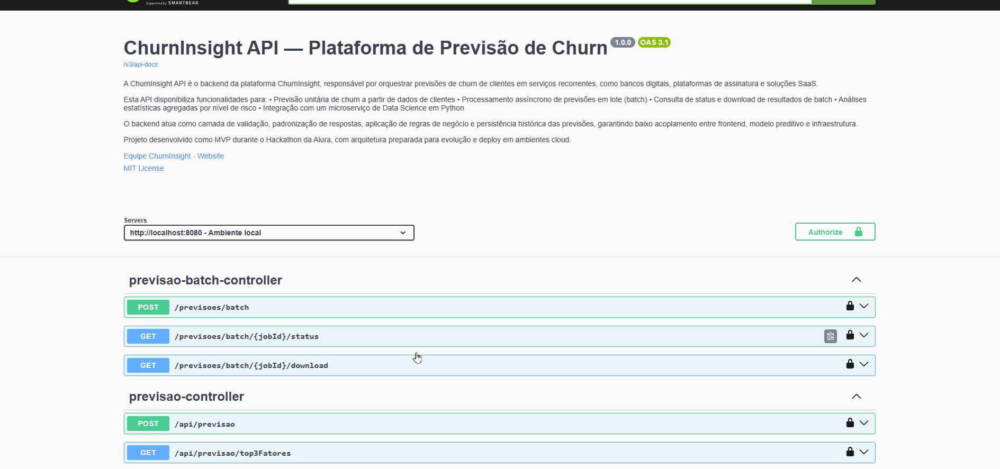

# 🎥 Swagger UI – Demonstrações Visuais da API

Este documento apresenta demonstrações visuais do Swagger UI utilizado na API ChurnInsight, facilitando o entendimento e consumo dos endpoints disponíveis.

Os exemplos abaixo ilustram requisições reais, respostas da API e fluxos completos, tanto para previsões unitárias quanto para processamento em lote.

---

## 📌 Visão Geral

A interface Swagger UI permite:

- Explorar todos os endpoints disponíveis
- Testar requisições diretamente pelo navegador
- Visualizar contratos de entrada e saída (JSON / CSV)
- Compreender fluxos síncronos e assíncronos da API
- Os GIFs a seguir demonstram o uso prático desses recursos.

---

## 🧪 Previsões em Lote (Batch – API Data Science)

### 📤 Enviar arquivo CSV para previsão em lote

Envia um arquivo CSV contendo múltiplos registros de clientes para processamento assíncrono pela API de Data Science.
A resposta retorna um Job ID, utilizado para acompanhamento do processamento.

---

### ⏳ Consultar status da previsão em lote

Consulta o status de um job de previsão em lote a partir do Job ID.
Estados possíveis:

- Processando
- Finalizado
- Erro
  

---

### 📥 Download do resultado da previsão em lote

Realiza o download do arquivo CSV com os resultados da previsão após a finalização do processamento.

---

## 🔮 Previsão Unitária (Tempo Real)

### 📤 Solicitar previsão única

Envia dados de um único cliente via JSON e recebe como resposta a previsão indicando se o cliente tende a cancelar ou continuar, juntamente com informações adicionais do modelo.

---

## 📊 Consultas Analíticas (Backend)

### 📈 Consultar estatísticas gerais

Consulta dados estatísticos persistidos no banco de dados do backend, permitindo análises agregadas sobre previsões realizadas.

---

### 🍩 Visualizar gráfico de rosca – Nível de risco

Retorna dados para construção de um gráfico de rosca, representando a distribuição de clientes por nível de risco de churn.

---

### 📊 Top 3 fatores de cancelamento

Retorna os três principais fatores que mais influenciam o cancelamento de clientes, normalmente utilizados para exibição em gráfico de barras.

---

## 🧩 Domínios e Dados de Apoio

### 📋 Domínios utilizados pelo frontend

Retorna listas de domínios (enums) utilizados pelo frontend, como:

- Países
- Gêneros

Esses dados são usados para popular dropdowns e formulários.

---

## 🩺 Monitoramento e Infraestrutura

### ❤️ Health Check

Endpoint de verificação de saúde da aplicação, utilizado para monitoramento e validação de disponibilidade.

---

### 🏠 Endpoint raiz

Endpoint raiz da aplicação (/), geralmente utilizado para validação básica de funcionamento do serviço em produção.

---

## 📚 Navegação Completa pelo Swagger UI

Demonstração da navegação geral pela interface Swagger UI, destacando:

- Organização dos endpoints
- Descrições
- Modelos de request e response
  

 
<a href="../README.md">🔄 Voltar para a documentação completa</a>

